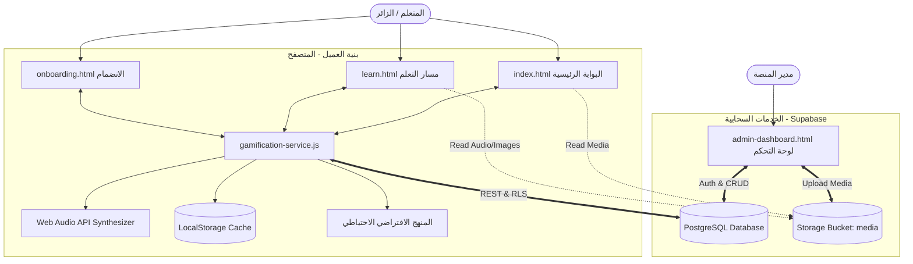
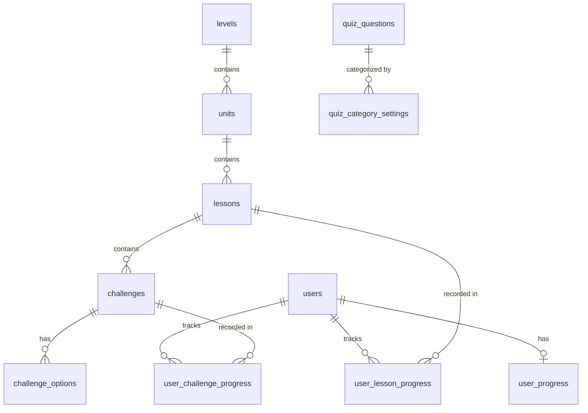

# 📜 MG COPTIC — منصة تعليم اللغة القبطية التفاعلية
> **المنصة المتكاملة والحديثة لتعلّم وإتقان اللغة القبطية الكنسية (اللهجة البحيرية) بأسلوب تفاعلي وتلعيب تعليمي شيق (Gamification).**

<div align="center">


</div>

---

## 📑 فهرس المحتويات
1. [🌟 عن المشروع والرؤية](#-عن-المشروع-والرؤية)
2. [✨ المميزات والوحدات الرئيسية](#-المميزات-والوحدات-الرئيسية)
3. [🗺️ هيكل المجلدات والملفات](#️-هيكل-المجلدات-والملفات)
4. [🏗️ البنية الهندسية وتدفق البيانات (System Architecture)](#️-البنية-الهندسية-وتدفق-البيانات-system-architecture)
5. [🗄️ مخطط قاعدة البيانات وسياسات الأمان (Database Schema & RLS)](#️-مخطط-قاعدة-البيانات-وسياسات-الأمان-database-schema--rls)
6. [🎮 محرك التلعيب والصوتيات (Gamification & Audio Engine)](#-محرك-التلعيب-والصوتيات-gamification--audio-engine)
7. [🎨 نظام التصميم والهوية البصرية (Design System)](#-نظام-التصميم-والهوية-البصرية-design-system)
8. [📚 تفاصيل المنهج الدراسي (Level 1: Bohairic Alphabet)](#-تفاصيل-المنهج-الدراسي-level-1-bohairic-alphabet)
9. [🛠️ دليل التثبيت والتهيئة والتشغيل (Setup & Deployment)](#️-دليل-التثبيت-والتهيئة-والتشغيل-setup--deployment)
10. [🛡️ لوحة التحكم والإدارة (Admin Dashboard)](#️-لوحة-التحكم-والإدارة-admin-dashboard)
11. [🔮 خارطة الطريق والتطوير المستقبلي (Roadmap)](#-خارطة-الطريق-والتطوير-المستقبلي-roadmap)
12. [📜 الترخيص وحقوق النشر (License)](#-الترخيص-وحقوق-النشر-license)

---

## 🌟 عن المشروع والرؤية

منصة **MG COPTIC** هي مبادرة رقمية تعليمية متطورة تهدف إلى إحياء وتسهيل دراسة **اللغة القبطية** (بلهجتها البحيرية المعتمدة في الطقس الكنسي). تم تصميم المنصة لتجمع بين:
1. **الأصالة التراثية**: هوية بصرية مأخوذة من المخطوطات القديمة وألوان ورق البردي والعنابي الملكي والذهب الأثري مع خطوط قبطية أصلية دقيقة.
2. **الحداثة والتقنية**: تجربة ويب تفاعلية سريعة (Single Page Application UX)، مزامنة سحابية حية مع **Supabase**، عمل بدون إنترنت عبر **LocalStorage Fallback**، ونظام صوتي اصطناعي فوري بـ **Web Audio API**.
3. **التلعيب الممتع (Gamification)**: مسار تعلّم متدرج (على طراز Duolingo)، قلوب وطاقة، نقاط خبرة (XP)، أيام متتالية (Streaks)، صناديق كنز، ولوحة متصدرين ومنافسات أسبوعية.

---

## ✨ المميزات والوحدات الرئيسية

### 1️⃣ البوابة الرئيسية والتقويم القبطي الحي (`index.html`)
* **التقويم القبطي الحي**: حساب فلكي دقيق باليوم والشهر القبطي وسنة الشهداء وعرض التاريخ الميلادي المقابل تلقائياً عند الغروب.
* **أبجدية الحروف (٣٢ حرفاً)**: بطاقات ثلاثية الأبعاد تنقلب عند النقر لتكشف النطق بالعربية، النطق الصوتي، القيمة العددية، والتمييز بين الحروف القبطية الأصيلة واليونانية الأصل.
* **قاموس المفردات المصور**: محرك بحث فوري وتصفية حسب الفئات (طقسية، عائلة، أفعال، أرقام، عام)، مع إمكانية مساهمة المستخدم وإضافة كلمات تحفظ محلياً.
* **قواعد اللغة والتركيب**: دروس منسقة وجداول تشرح أدوات التعريف والتنكير، الضمائر المستقلة، وبادئات الأفعال.
* **محرك الاختبارات الذكي (Quiz Engine)**:
  * تخصيص حسب الأقسام (حروف، مفردات، قواعد).
  * تحديد مستوى الصعوبة (سهل، متوسط، صعب).
  * عداد تنازلي ومؤقت شريطي لكل سؤال.
  * صفحة مراجعة تفصيلية للإجابات الصحيحة والخاطئة مع إمكانية إعادة المحاولة.
* **لوحة المتصدرين (Leaderboard)**:
  * منصة التتويج للمراكز الثلاثة الأولى (Podium) مع التيجان والميداليات الذهبية والفضية والبرونزية.
  * تصفية الفترات (أسبوعي / شهري / كلي).
  * بطاقة إبراز لترتيب المستخدم الشخصي ومنطقة التأهل للدوري القادم.
* **الملف الشخصي والإعدادات**:
  * رفع وتغيير الصورة الرمزية للمستخدم (Avatar) أو إزالتها.
  * تعديل الاسم المستعار المعروض.
  * تبديل تشغيل المؤثرات الصوتية.
  * تحديد الهدف اليومي للنقاط (١٥ خفيف / ٣٠ عادي / ٥٠ مكثف).

---

### 2️⃣ مسار التعلم التفاعلي (`learn.html`)
* **شجرة المستويات والوحدات (Learning Path)**:
  * وحدات تعليمية متدرجة تفتح تباعاً بمجرد إنجاز الدروس السابقة.
  * عقد الدروس بتأثيرات الحركة ثلاثية الأبعاد (Active Glowing Nodes / Completed / Locked).
  * صناديق كنوز تفاعلية تمنح نقاط XP وقلوباً إضافية.
* **أربعة أنماط تفاعلية من التمارين (Challenge Types)**:
  1. `select`: اختيار الإجابة الصحيحة من متعدد مع نطق صوتي.
  2. `write`: ترتيب الحروف والقوالب الصوتية لتكوين الكلمة أو النطق.
  3. `listen`: الاستماع للنطق واختيار الحرف أو المقطع القبطي المقابل.
  4. `match`: مطابقة بطاقات الحروف القبطية مع أسمائها أو معانيها العربية بسلاسة.
* **نظام القلوب والخبرة**:
  * ٥ قلوب تبدأ بها كل جلسة، مع خصم قلب عند الإجابة الخاطئة، وإمكانية التعبئة.
  * احتفال بنهاية الدرس مع شريط تقدم ومؤثرات Confetti ونغمات نصر متناسقة.

---

### 3️⃣ تجربة الانضمام السلسة (`onboarding.html`)
* تدفق تفاعلي خطوة بخطوة للمتعلمين الجدد.
* جمع الاسم، الفئة العمرية، الهدف التعليمي، والمستوى الحالي.
* إنشاء ملف المستخدم ومزامنته محلياً وسحابياً ثم نقله تلقائياً إلى خريطة الدروس.

---

### 4️⃣ لوحة التحكم الإدارية الشاملة (`admin-dashboard.html`)
* واجهة تحكم متقدمة ومحمية تسمح للمشرفين بإدارة:
  * **الحروف**: إضافة وتعديل الرموز، النطق، التسجيلات الصوتية، والترتيب.
  * **المفردات**: إدارة الكلمات والصور وملفات الصوت وحالة الاعتماد (`approved` / `pending`).
  * **القواعد والمقالات**: محرر نصي منسق (Rich Text Editor) يدعم الصور والروابط والجداول وتحديد حالة النشر.
  * **بنك الأسئلة والاختبارات**: إضافة أسئلة MCQ أو مقالية، وتحديد الوقت بالثواني، وربط المصادر، وتحديد حصة الأسئلة لكل فئة.
  * **المنهج والمسار**: إضافة وتعديل المستويات والوحدات والدروس والتمارين وخياراتها.
  * **التخزين السحابي (Media Storage)**: رفع الوسائط إلى حاوية `media` في Supabase بنقرة واحدة.

---

## 🗺️ هيكل المجلدات والملفات

```text
COPTICCC/
├── index.html                               # البوابة الرئيسية (الحروف، القاموس، القواعد، الاختبارات، التصنيف، الإعدادات)
├── learn.html                               # مسار التعلم التفاعلي والألعاب (شجرة الوحدات، التمارين، القلوب)
├── onboarding.html                          # واجهة الانضمام وتحديد المستوى للمستخدمين الجدد
├── admin-dashboard.html                     # لوحة التحكم وإدارة المحتوى والوسائط
├── gamification-service.js                  # المحرك الموحد للألعاب، الأصوات (Web Audio API)، وإدارة المستخدم والمناهج
├── girges.woff                              # الخط القبطي المضمن لعرض الرموز القبطية الأصيلة
├── schema.sql                               # المخطط الأولي لقاعدة بيانات Supabase (الحروف، المفردات، القواعد، سياسات RLS)
├── migration-2-quizzes-media.sql             # الترحيل الثاني: بنك الأسئلة، إعدادات الاختبارات، التخزين السحابي
├── migration-3-gamification-curriculum.sql   # الترحيل الثالث: المستخدمين، التقدم، الوحدات، الدروس، التمارين، وتعبئة المستوى 1
└── README.md                                # التوثيق الشامل للمشروع (هذا الملف)
```

---

## 🏗️ البنية الهندسية وتدفق البيانات (System Architecture)



---

## 🗄️ مخطط قاعدة البيانات وسياسات الأمان (Database Schema & RLS)

تم تصميم قاعدة البيانات في **Supabase PostgreSQL** لتكون نموذجية ومهيأة للسرعة وقابلة للتوسع.

### 📊 مخطط العلاقات بين الجداول (ERD)



### 📋 قائمة الجداول ووظائفها

| اسم الجدول | الوظيفة | الحقول البارزة |
| :--- | :--- | :--- |
| `letters` | جدول الأبجدية القبطية الـ 32 | `id`, `glyph`, `name`, `translit`, `sound`, `num`, `audio_filename`, `is_native`, `sort_order` |
| `vocabulary` | قاموس الكلمات والمصطلحات | `id`, `coptic`, `translit`, `meaning`, `category`, `image_url`, `audio_filename`, `status`, `sort_order` |
| `grammar_sections` | أقسام وقواعد اللغة والشروحات | `id`, `title`, `content_html`, `sort_order` |
| `quiz_questions` | بنك أسئلة الاختبارات العامة | `id`, `type`, `question`, `options`, `correct_index`, `model_answer`, `category`, `difficulty`, `time_seconds`, `link_url` |
| `quiz_category_settings`| عدد الأسئلة المخصص لكل فئة | `category`, `questions_count` |
| `articles` | المقالات والأخبار المنشورة بالرئيسية | `id`, `title`, `content_html`, `sort_order`, `is_published` |
| `users` | سجلات المتعلمين (ضيوف ومسجلين) | `id`, `full_name`, `age`, `is_anonymous`, `email`, `created_at` |
| `user_progress` | النقاط والقلوب والستريك | `user_id`, `hearts`, `points`, `streak_days`, `last_active_date` |
| `levels` | مستويات المسار التعليمي | `id`, `title`, `description`, `order_index` |
| `units` | الوحدات التدريبية داخل كل مستوى | `id`, `level_id`, `title`, `order_index` |
| `lessons` | الدروس داخل كل وحدة | `id`, `unit_id`, `title`, `order_index` |
| `challenges` | التمارين والأسئلة التفاعلية للدرس | `id`, `lesson_id`, `type` (select/write/listen/match), `question`, `order_index` |
| `challenge_options` | خيارات التمارين وإجاباتها | `id`, `challenge_id`, `text`, `is_correct`, `image_url`, `audio_url` |
| `user_lesson_progress` | حالة إنجاز الدروس للمتعلم | `user_id`, `lesson_id`, `status` (locked/in_progress/completed), `score` |
| `user_challenge_progress` | حالة إكمال التمارين الفردية | `user_id`, `challenge_id`, `completed` |

### 🔒 أمان البيانات (Row Level Security - RLS)
* **القراءة العامة (`Public Read`)**: مسموحة لجميع الزوار بدون تسجيل دخول لقراءة الحروف، الكلمات المعتمدة (`approved`)، القواعد، المقالات المنشورة، المناهج والتمارين، والوسائط المرفوعة.
* **الكتابة والإدارة (`Admin Authenticated`)**: محصورة على المشرفين المسجلين في لوحة التحكم لإضافة وتعديل وحذف المحتوى والأسئلة ورفع الوسائط في حاوية `media`.
* **بيانات المستخدمين والتقدم**: مسموح للمستخدم بإنشاء حسابه وتحديث تقدمه ونقاطه مع عزل كامل بين سجلات المستخدمين.

---

## 🎮 محرك التلعيب والصوتيات (Gamification & Audio Engine)

تم بناء الملف `gamification-service.js` ليكون عموداً فقرياً مستقلاً وذكي يربط كل صفحات المنصة:

### 1. توليد النغمات الفورية عبر Web Audio API
لا يحتاج الموقع إلى تحميل ملفات صوتية خارجية ضخمة للتفاعلات البسيطة؛ فالمحرك يقوم بتوليف الترددات والموجات الصوتية آنياً داخل المتصفح:
* **نغمة الإجابة الصحيحة (`playCorrect`)**: توليد نغمة ثنائية متصاعدة ومبهجة (C5 $\rightarrow$ G5: 523Hz ثم 784Hz) بموجة جيبية ناعمة.
* **نغمة الخطأ (`playWrong`)**: نغمة ثلاثية منخفضة ومائلة للتنبيه (220Hz $\rightarrow$ 180Hz $\rightarrow$ 140Hz) بموجة منشارية (Sawtooth).
* **صندوق الكنز والجوائز (`playChestReward` / `playFanfare`)**: تتابع نغمي احتفالي متعدد الطبقات (Arpeggio) يحاكي ألعاب الفيديو الكلاسيكية.
* **نغمة الأيام المتتالية والستريك (`playStreakBonus`)**: نغمة تصاعدية سريعة تمنح شعوراً بالإنجاز.

### 2. خوارزمية حساب الأيام المتتالية (Daily Streaks Algorithm)
يقوم المحرك بمقارنة تاريخ اليوم (`YYYY-MM-DD`) بآخر تاريخ نشاط للمتعلم:
* إذا كان الفارق **يوم واحد بالضبط (Diff = 1)** $\rightarrow$ يزداد الستريك بمقدار +1.
* إذا كان النشاط **في نفس اليوم (Diff = 0)** $\rightarrow$ يبقى الستريك كما هو دون زيادة مكررة.
* إذا انقطع المستخدم **لأكثر من يوم (Diff > 1)** $\rightarrow$ يعود الستريك إلى 1 لتشجيع المتعلم على الالتزام اليومي.

### 3. العمل دون انقطاع (Zero-Downtime LocalStorage Fallback)
في حال تعثر الاتصال بـ Supabase أو بطء شبكة المستخدم، ينتقل المحرك تلقائياً وبشكل غير مرئي إلى الذاكرة المحلية `localStorage` ويحمّل المنهج المضمن للمستوى الأول كاملاً بجميع وحداته الـ 7 وتمارينه الـ 35 دون أي توقف في التجربة.

---

## 🎨 نظام التصميم والهوية البصرية (Design System)

تم استلهام لوحة الألوان من بيئة الأديرة القبطية والمخطوطات القديمة المحفوظة في المتاحف:

```css
:root {
  /* خلفيات ورق البردي */
  --parchment: #F3E9D2;        /* الخلفية الأساسية - بيچ دافئ مريح للعين */
  --parchment-soft: #FAF3E4;   /* أسطح البطاقات والعناصر المرتفعة */
  --parchment-card: #FAF3E4;   /* أسطح المودال والبطاقات */
  --parchment-2: #E8DCBE;      /* حدود دافئة وفواصل */

  /* العنابي الملكي (لون الحبر الكنسي والستائر) */
  --madder: #6B1530;           /* اللون الأساسي للأزرار والعناوين والدروس النشطة */
  --madder-light: #8C2438;     /* درجات التحويم (Hover States) */
  --madder-dark: #4A0E21;      /* الظلال والقواعد العميقة */

  /* الذهب الأثري */
  --gold: #B8892E;             /* التمييز، النجوم، الكؤوس، التتويج */
  --gold-light: #D4B96A;       /* الخطوط الفاصلة والأطر المضيئة */
  --gold-pale: #FAF3E4;        /* إشراقات ناعمة */

  /* حبر المخطوطات للنصوص */
  --ink: #2E2018;              /* لون النص الأساسي المقروء */
  --ink-soft: #5A4A3E;         /* النصوص الفرعية والوصفية */

  /* الألوان الدلالية */
  --teal: #1A4A4A;             /* الشارات الثانوية والوسوم */
  --ok: #2E6B3E;               /* النجاح والإجابة الصحيحة */
  --err: #6B1530;              /* التنبيه والإجابة الخاطئة */
}
```

### الخطوط المستخدمة
1. **`Cairo` & `Tajawal`**: للعناوين والنصوص العربية المعاصرة بدرجات وزن من 500 إلى 900.
2. **`girges.woff` & `Noto Sans Coptic`**: خطوط مخصصة مدمجة لعرض الحروف والكلمات القبطية بأعلى درجات الدقة والجمال الطباعي.

---

## 📚 تفاصيل المنهج الدراسي (Level 1: Bohairic Alphabet)

يغطي المستوى الأول في المنصة كامل الأبجدية القبطية (32 حرفاً) مقسمة منهجياً على **7 وحدات تدريبية متكاملة**:

| الوحدة | الشارة | الحروف المشمولة | المفاهيم والنطق المغطى | عدد التمارين |
| :---: | :---: | :--- | :--- | :---: |
| **الوحدة 1** | `Ⲁ` | Ⲁ ⲁ، Ⲃ ⲃ، Ⲅ ⲅ، Ⲇ ⲇ، Ⲉ ⲉ | ألفا (أَ)، فيدا (ڤ/ب)، غاما (غ/ج/ن)، دلدا (د/ذ)، إي (إ) | 5 تمارين |
| **الوحدة 2** | `Ⲍ` | Ⲍ ⲍ، Ⲏ ⲏ، Ⲑ ⲑ، Ⲓ ⲓ، Ⲕ ⲕ | زاتا (ز)، هيتا (يه ممدودة)، ثيتا (ث/ت)، إيوتا (ي)، كابا (ك) | 5 تمارين |
| **الوحدة 3** | `Ⲗ` | Ⲗ ⲗ، Ⲙ ⲙ، Ⲛ ⲛ، Ⲝ ⲝ، Ⲟ ⲟ | لابدا (ل)، مي (م)، ني (ن)، كسي (كس مرکب)، أو القصيرة (ُأ) | 5 تمارين |
| **الوحدة 4** | `Ⲡ` | Ⲡ ⲡ، Ⲣ ⲣ، Ⲥ ⲥ، Ⲧ ⲧ، Ⲩ ⲩ | بي (ب صريحة)، رو (ر)، سيما (س/ز)، تاف (ت)، إبسيلون (و/ي/ڤ) | 5 تمارين |
| **الوحدة 5** | `Ⲫ` | Ⲫ ⲫ، Ⲭ ⲭ، Ⲯ ⲯ، Ⲱ ⲱ | في (ف مفخمة)، خي (خ/ك/ش)، إبسي (بس مركب)، أوميغا (أوو طويلة) | 5 تمارين |
| **الوحدة 6** | `Ϣ` | Ϣ ϣ، Ϥ ϥ، Ϧ ϧ، Ϩ ϩ | **الحروف القبطية الأصيلة**: شاي (ش)، فاي (ف)، خاي (خ حلقية)، هوري (هـ) | 5 تمارين |
| **الوحدة 7** | `Ϫ` | Ϫ ϫ، Ϭ ϭ، Ϯ ϯ، Ⲋ ⲋ | جانجا (ج/دج)، تشيما (تش)، تي (تي مقطع)، سو (رقم ٦) وإتقان الأبجدية | 5 تمارين |

---

## 🛠️ دليل التثبيت والتهيئة والتشغيل (Setup & Deployment)

### 1. إعداد قاعدة بيانات Supabase
قم بإنشاء مشروع مجاني على [Supabase.com](https://supabase.com)، ثم افتح **SQL Editor** وشغّل ملفات الترحيل بالترتيب التالي:

1. **تشغيل `schema.sql`**: لإنشاء الجداول الأساسية (`letters`, `vocabulary`, `grammar_sections`) وسياسات الRLS والبيانات الأولية.
2. **تشغيل `migration-2-quizzes-media.sql`**: لإنشاء جدول أسئلة الاختبارات، إعدادات الفئات، وحاوية تخزين الوسائط `media`.
3. **تشغيل `migration-3-gamification-curriculum.sql`**: لإنشاء جداول الألعاب والمستخدمين والمنهج التفصيلي للمستوى الأول مع كامل التمارين.

> [!TIP]
> جميع ملفات الـ SQL في المشروع مكتوبة بأسلوب **Idempotent** (تحتوي على `IF NOT EXISTS` وشروط عدم التكرار)، مما يعني أنه يمكنك تشغيلها بأمان تام دون الخوف من فقدان البيانات أو تكرارها.

### 2. ضبط مفاتيح الربط في الكود
المفاتيح مدمجة بالفعل في ملفات المشروع وفي `gamification-service.js`. إذا أردت استخدام مشروعك الخاص، حدّث الثوابت التالية:
```javascript
const MG_CONFIG = {
  SUPABASE_URL: 'https://YOUR_PROJECT_REF.supabase.co',
  SUPABASE_ANON_KEY: 'YOUR_SUPABASE_ANON_KEY'
};
```

### 3. التشغيل المحلي (Local Development)
بما أن المشروع مبني بتقنيات الويب القياسية الخالصة (Vanilla JS + HTML5 + CSS3)، يمكنك تشغيله بعدة طرق سهلة:

#### أ) باستخدام VS Code Live Server
* انقر بيمين الفأرة على ملف `index.html` واختر **Open with Live Server**.

#### ب) باستخدام Python
```bash
python -m http.server 8000
```
ثم توجه في المتصفح إلى: `http://localhost:8000/index.html`.

#### ج) باستخدام Node.js (npx serve)
```bash
npx -y serve .
```

### 4. النشر السحابي (Deployment)
المشروع جاهز فوراً للنشر على منصات الاستضافة المجانية مثل **Netlify** أو **Vercel** أو **GitHub Pages**:
* اسحب مجلد المشروع وأفلته في **Netlify Drop** وسيعمل الموقع مباشرة مع شهادة SSL وحماية كاملة.

---

## 🛡️ لوحة التحكم والإدارة (Admin Dashboard)

توفر لوحة التحكم (`admin-dashboard.html`) أدوات متكاملة لإدارة المنصة:

1. **الوصول للوحة**: افتح `admin-dashboard.html` وسجل الدخول بحساب المشرف في Supabase.
2. **إدارة الكلمات والصور**:
   * إضافة كلمة قبطية مع نطقها ومعناها وفئتها.
   * رفع صورة توضيحية مباشرة من جهازك إلى حاوية التخزين السحابي `media` ليتم توليد الرابط وحفظه تلقائياً.
3. **محرر القواعد والمقالات**:
   * محرر نصوص غني بالخيارات لتنسيق الخطوط، إضافة روابط خارجية، وتضمين وسائط.
4. **إدارة بنك الاختبارات**:
   * إضافة أسئلة اختيار من متعدد أو أسئلة مقالية مع الإجابة النموذجية.
   * تحديد وقت الإجابة بالثواني ومستوى الصعوبة ورابط الشرح الإضافي.

---

## 🔮 خارطة الطريق والتطوير المستقبلي (Roadmap)

- [x] **المرحلة الأولى**: إطلاق البوابة الشاملة، التقويم القبطي الحي، القاموس المصور، الأبجدية التفاعلية، والاختبارات.
- [x] **المرحلة الثانية**: محرك التلعيب المتقدم، شجرة الدروس (Duolingo Style)، نظام الصوتيات بـ Web Audio API، وتطبيق المستوى الأول (7 وحدات).
- [ ] **المرحلة الثالثة**: إضافة المستوى الثاني (مفردات الحياة اليومية والمحادثات) والمستوى الثالث (النصوص والصلوات الطقسية).
- [ ] **المرحلة الرابعة**: إضافة التعرف على الصوت (Speech Recognition) لتقييم نطق المتعلم للقبطية باستخدام الذكاء الاصطناعي.
- [ ] **المرحلة الخامسة**: تحويل المنصة إلى تطبيق تقدمي كامل (Progressive Web App - PWA) يتيح التثبيت على هواتف Android و iOS بدون متجر تطبيقات.

---

## 📜 الترخيص وحقوق النشر (License)

هذا المشروع متاح ومفتوح المصدر تحت ترخيص **[MIT License](https://opensource.org/licenses/MIT)** — ويهدف لخدمة وتيسير تعليم التراث واللغة القبطية لكل الناطقين بالعربية حول العالم مجاناً.

<div align="center">
  <sub>صُنع بمحبة وإتقان لخدمة التراث واللغة القبطية الكنسية ⲡⲓⲣⲉϥϯⲥⲃⲱ ⲛ̀ⲧⲉ ϯⲁⲥⲡⲓ ⲛ̀ⲣⲉⲙⲛ̀ⲭⲏⲙⲓ</sub>
</div>
